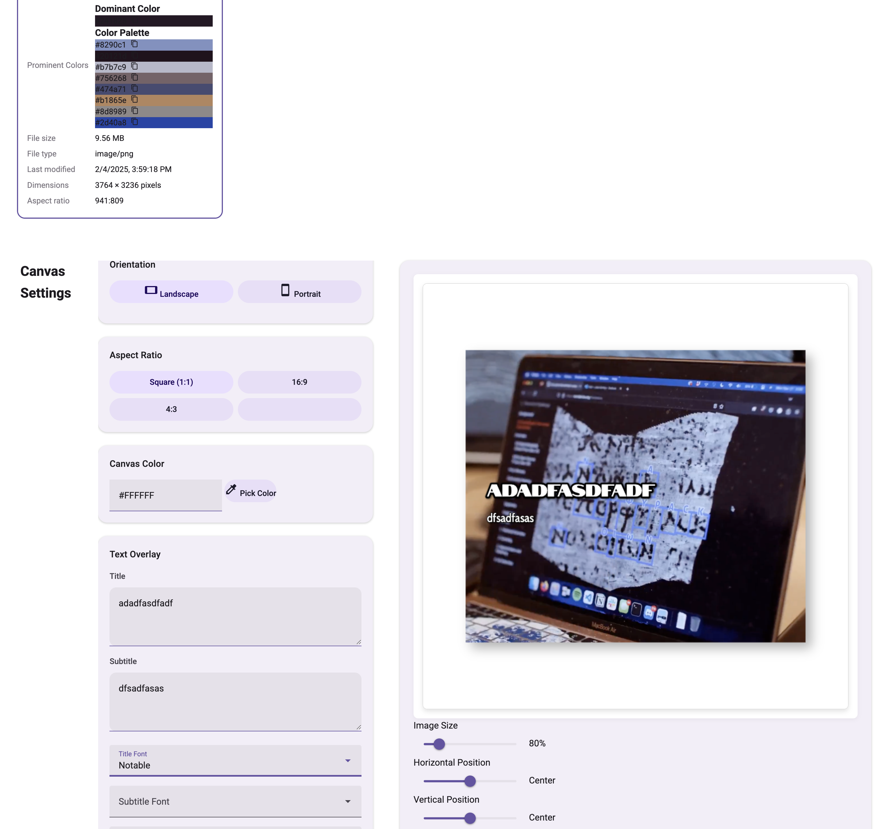

# Image Processing Tool

A web-based tool for processing images with various features including image format conversion, adding watermarks, and creating YouTube thumbnails.



## Features (Current Version)
- Drag and drop image upload
- File selection through browser
- Support for multiple image formats (PNG, JPG, JPEG, WEBP, HEIC)
- Image preview with file information
- Responsive design

## How to Run

1. Make sure you have Python installed on your system
2. Open a terminal in the project directory
3. Run the following command:
   ```bash
   python server.py
   ```
4. Open your web browser and navigate to:
   ```
   http://localhost:8000
   ```

## Usage

1. **Upload Images:**
   - Drag and drop images onto the upload area
   - OR click the "Choose Files" button to select images from your computer

2. **View Uploads:**
   - Uploaded images will appear in the preview area below
   - Each preview shows the image and file information

## Supported Image Formats
- PNG
- JPG/JPEG
- WEBP
- HEIC

## Browser Compatibility
- Chrome
- Firefox
- Safari
- Edge 